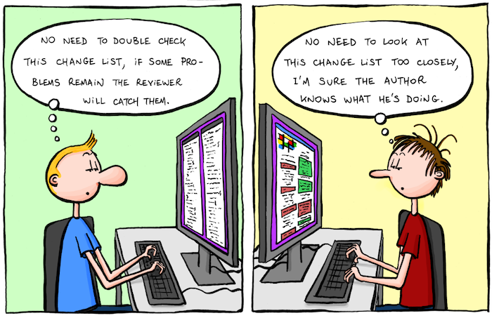

### Code Reviews Are Your Friend!

#### Maria Mckinley
#### Staff Software Engineer and SRE at Disney

# Outline
* Mental Models
* What Makes Code Reviews Hard
* But, Why?
* What the Science Says About Failure
* Making Code Reviews Better

# Outline
* Mental Models
* What Makes Code Reviews Hard
* But, Why?
* What the Science Says About Failure
* Making Code Reviews Better

## Mental Model of a Tree by a Scientist

## Mental Model of a Tree by a Child
 

## According to Gitlab:
## A code review is a peer review of code that helps developers ensure or improve the
## code quality before they merge and ship it.

## A better mental model:
## A code review is a way for a team to share knowledge and learn together (and
## assess the quality of the code they are shipping before they ship it).

## Emphasize team growth and learning over code quality.
## Code quality follows from team quality

## Teamwork and Communication May be Important

## Lots of research backs up the importance of teamwork on software development
### Leave it as an exercise for the audience, good place to start:
### https://www.atlassian.com/blog/teamwork/the-importance-of-teamwork

## I want to convince you that code reviews can be the pathway to a better team

# Outline
* Mental Models
* What Makes Code Reviews Hard
* But, Why?
* What the Science Says About Failure
* Making Code Reviews Better

## What makes code reviews hard?

<!-- .slide: data-background-image="assets/headline.jpg"-->

---

## Developer failed!
### fear of failure
### fear of bad news

<!-- .slide: data-background-image="assets/headline.jpg"-->

---

## Developer gets in an argument!
### fear of conflict
### actual conflict, squabbles

<!-- .slide: data-background-image="assets/headline.jpg"-->

---

## Developer runs out of time!
### fear of losing
### fear of deadlines

<!-- .slide: data-background-image="assets/headline.jpg"-->

---

## Developer feels shame
### internalizes criticism

# Outline
* Mental Models
* What Makes Code Reviews Hard
* But, Why?
* What the Science Says About Failure
* Making Code Reviews Better

Frazz by Jef Mallett

### fixed mindset vs growth mindset
#### https://hiddenbrain.org/podcast/innovation-2-0-multiplying-the-growth-mindset/
### expectation we are done learning when we leave school

## Images of who is a software dev

https://hiddenbrain.org/podcast/you-2-0-befriending-your-inner-voice/

## We are not taught how to productively disagree
https://news.hiddenbrain.org/i/43578267/brain-waves

## We are taught to think of team members as our competition

## We learn to internalize criticism
https://psychcentral.com/lib/what-is-toxic-shame

# Outline
* Mental Models
* What Makes Code Reviews Hard
* But, Why?
* What the Science Says About Failure
* Making Code Reviews Better

## Better Ways to Think of Failure

### We could learn more from failure than success 

## Easier to learn from each other's mistakes
## Beneficial that you see other people make mistakes
https://hiddenbrain.org/podcast/learning-from-your-mistakes/

## Difficult discussions is where growth and learning happen
https://hbr.org/2019/08/learning-is-supposed-to-feel-uncomfortable

## Mental Model: Failure is something for us to overcome
## Better Mental Model: Failure is a teaching tool

## As developers, we already do this...
* Troubleshooting
* Systematically figuring out what does not work

## Your new mantra:
## You did not fail. The code failed, and you learned.

## Fundamentally, we often take criticism about our work too personally

## To help us separate our work from our selves, remember:
* we are not the code we write
* we are working on something bigger than ourselves

* pause and pay attention to how we react to criticism
* take a break to re-set

## what have we learned about failure?
### We can learn more from failure than success
### We learn more from other's failures
### Transparent failure helps everyone see everyone makes mistakes
### We learn more with less Ego

# Outline
* Mental Models
* What Makes Code Reviews Hard
* But, Why?
* What the Science Says About Failure
* Making Code Reviews Better

## We are all imperfect humans.
## Our culture has taught us to fear failure. Be kind.
### consider creating a team code of conduct

* Terse communication can feel like an attack
* Consider your audience
* Consider switch from async to sync
* Learn to disagree constructively

### Incorporate pair coding for the win
Some of the very first programmers were the women who worked on the ENIAC (Electronic Numerical Integrator and Computer). These women worked in pairs, allowing them to discuss ideas and improve each other's work.
https://martinfowler.com/articles/on-pair-programming.html

* Learn to think of your code separate from you
* Focus on your team and your project, not "your" code
* Difficult discussions is where growth and learning happen, practice embracing them

## What if the person requesting the code review was required to come up with one suggestion to improve the existing code?
* more big picture focus
* chips away at tech debt
* one person is no longer the focus of entire review

## Review the code reviews, retrospectives
* long back and forths in writing: talk instead!
* bike shedding
* rubber stamping

# TL;DR
* Be curious
* Look out for your teammates

Code Review Goal:

To get people enthusiastic and curious about exploring varied ways to solve coding problems, discussing what may have been missed, and how we as a team can improve our code

# Thank you

Code Review Champion by Dan Goslen
store.dangoslen.me

Hidden Brain
hiddenbrain.org

### https://codedragon.github.io/code_reviews
### maria@mariakathryn.net

### Reviewee:
* follow checklist (self review)
* think about what you want to learn
* stuck? draft code review
* expect to learn something

### Reviewee (continued):
* respond, don't react (create distance to digest and get past the initial punch to the gut)
* play around with suggestions, request to hop on a call together
* patience with yourself

### Reviewee (continued):
* practice saying, "that is interesting, let me think about that" to reviews
* remember, you are paid to think

### Reviewer:
* write comments only after you have looked at all of the code: limits issues, clears questions
* ask for feedback, is this review helpful to you? imagine yourself reading your comments

### Reviewer (continued):
* find ways to complement the code
* be humble, you could be mistaken
* site evidence, verify beliefs, provide links
* good enough is good enough

### Team policies:
* Use processes and cicd to limit nitpicking
* limit code in a review (early review!)
* value time spent doing code reviews, emphasize learning

### Team policies (continued):
* do some code reviews "in person"
* Think like a team: Navy Seals succeed because they trust each other "shit happens", but we can survive and thrive through it (they have a learning mind set!)

### Team policies (continued):
* learn conflict resolution skills together
* Forcing process is not the way to win hearts and minds
* Team Code of Conduct

### Team policies (continued):
* Things getting heated? Take a break!
* Foster growth mindset
* Talk about expectations

### Being a team player
* Hey, someone reviewed my code today and I learned about this cool thing that they helped me implement, and now our code is better, and I learned something!

### Being a team player
* Hey, I found this article about x, which I thought might be helpful for our implementation of y. What do you all think?

## Consider for code review checklist (or cicd):
* requirements
* tests
* docs
* amount of code in review
* linter/formatter
