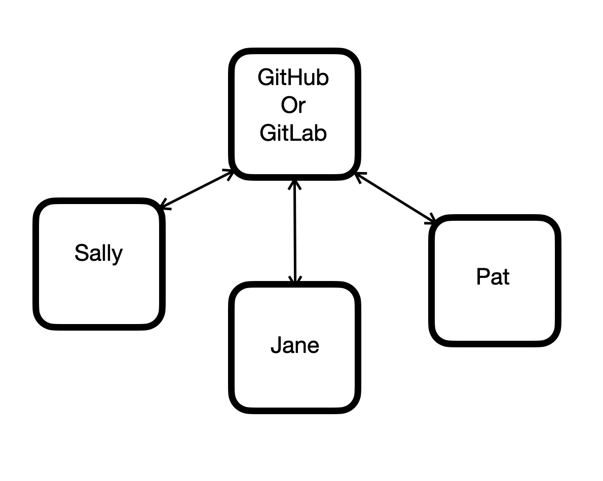

# Introduction to GIT
### An opionated guide

## Maria Mckinley
## Assisted by Franco Mattos Neto

#Outline
* Introduction to GIT
* Demonstration of using GIT

##Git keeps track of history and serves as a backup
###(as long as you push your changes to at least one other machine)

##Some definitions
* Repo: repository, a collection of files and folders that make a body of work
* Git:  a tool for saving history along with the body of work
* Github/Gitlab:  a central repository that everyone can reach and use

#Some important concepts
* Goal is to have everyone's local repo the same, including Github/Gitlab
* Git keeps track of all history

#Let's talk about the file system for a moment

Git puts everything it needs to keep track of changes in a hidden directory .git in each repository

#Installation
https://git-scm.com/book/en/v2/Getting-Started-Installing-Git

### https://codedragon.github.io/beginning_git
### maria@mariakathryn.net
