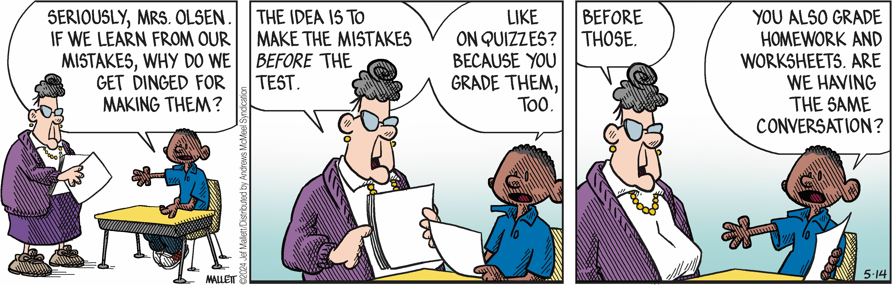

### Code Reviews
#### The Art and the Science

#### Maria Mckinley
#### Staff Software Engineer and SRE at Disney

# Outline
* Mental Models
* The trials of code reviews
* But, why?
* About Failure
* Making Code Reviews better

# Outline
* Mental Models
* The trials of code reviews
* But, why?
* About Failure
* Making Code Reviews better

## Mental Model of a Tree by a Scientist

## Mental Model of a Tree by a Child
 

## According to Gitlab:
## A code review is a peer review of code that helps developers ensure or improve the
## code quality before they merge and ship it.

## A better mental model:
## A code review is a way for a team to share knowledge, learn together and
## assess the quality of the code they are shipping before they ship it.

## Emphasize team growth and learning over code quality.
## Code quality follows from team quality

## Lots of research backs up the importance of teamwork on software development
### Leave it as an exercise for the audience, good place to start:
### https://www.atlassian.com/blog/teamwork/the-importance-of-teamwork

## I want to convince you that code reviews can be the pathway to a better team

# Outline
* Mental Models
* The trials of code reviews
* But, why?
* About Failure
* Making Code Reviews better

## What makes code reviews hard?

<!-- .slide: data-background-image="assets/headline.jpg"-->

---

## Developer failed!
### fear of failure
### fear of bad news

<!-- .slide: data-background-image="assets/headline.jpg"-->

---

## Developer gets in an argument!
### fear of conflict
### actual conflict, squabbles

<!-- .slide: data-background-image="assets/headline.jpg"-->

---

## Developer runs out of time!
### fear of losing
### fear of deadlines

# Outline
* Mental Models
* The trials of code reviews
* But, why?
* About Failure
* Making Code Reviews better

Frazz by Jef Mallett

* fixed mindset vs growth mindset
https://hiddenbrain.org/podcast/innovation-2-0-multiplying-the-growth-mindset/
* expectation we are done learning when we leave school

* Images of who is a software dev

https://hiddenbrain.org/podcast/you-2-0-befriending-your-inner-voice/

* not taught how to productively disagree
https://news.hiddenbrain.org/i/43578267/brain-waves

# Outline
* Mental Models
* The trials of code reviews
* But, why?
* About Failure
* Making Code Reviews better

## Better Ways to Think of Failure

## Better Ways to Think of Failure

Learn more from failure than success

# Thank you

### https://codedragon.github.io/code_reviews
### maria@mariakathryn.net
