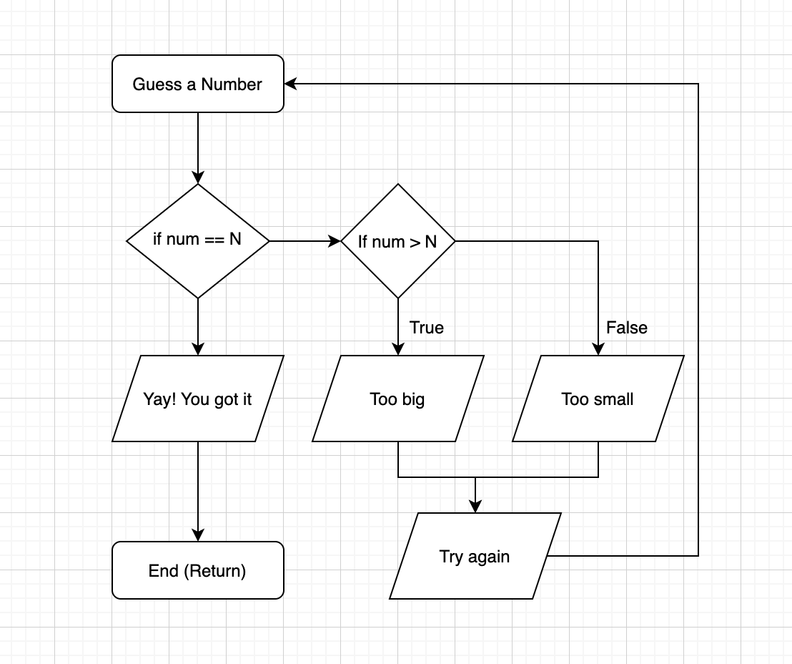
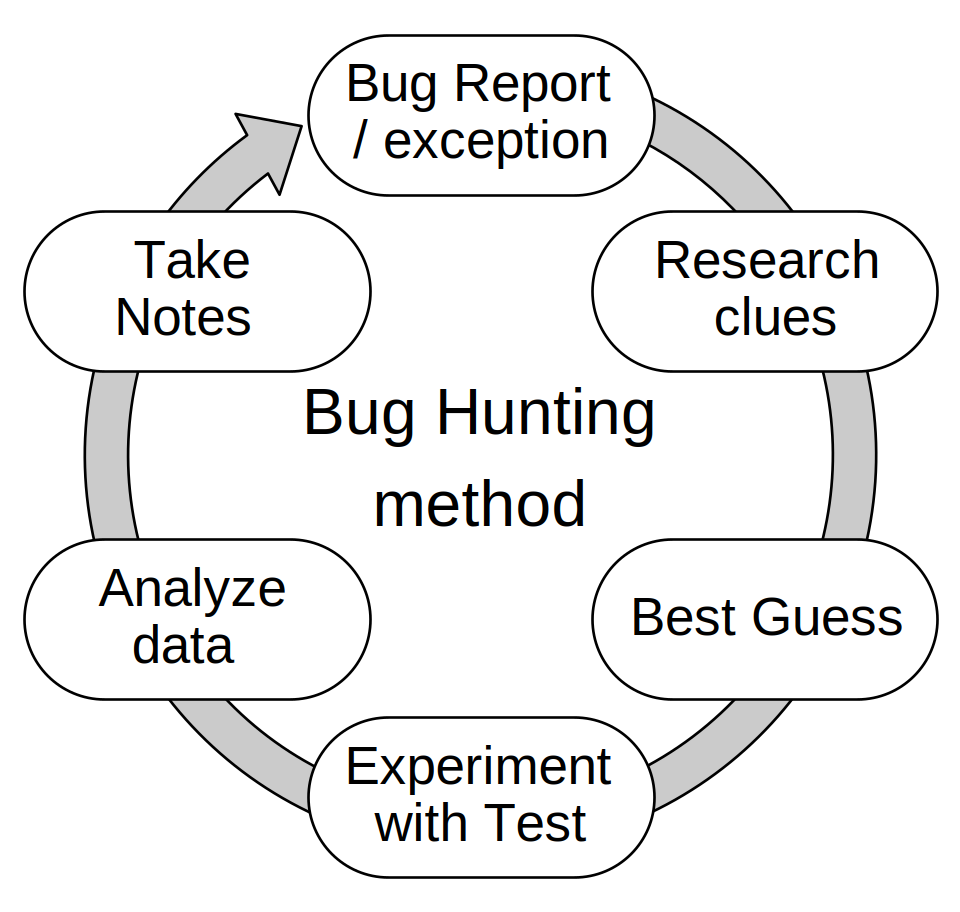

# Hunting the bugs

## Maria Mckinley


### The Eniac women were among the first coders to discover that software never works right the first time - and that a programmer's main work, really, is to find and fix the bugs.
### *New York Times Magazine*
### "The Secret History of Women in Coding"


# What is a bug?


# A bug is a general term used to describe any unexpected problem with hardware or software.


## User Error <!-- .element: class="fragment" data-fragment-index="1" -->
### Maybe documentation is the problem <!-- .element: class="fragment" data-fragment-index="2" -->
### Maybe the interface is the problem <!-- .element: class="fragment" data-fragment-index="3" -->


# Hunting Bugs
* <span style="background-color: #e6d300">Basic Steps for Trouble Shooting</span>
* Dig into Code & Error Messages
* More Tools for Trouble Shooting


# Scenario


# Verify the bug


# PSA
## periodically check your logs
* where you think they are
* logging what you think they should log
https://blog.guilatrova.dev/how-to-log-in-python-like-a-pro/


# Do NOT touch your code


# Write an integration test that FAILS
### (Test Driven Bughunting?)


# Why test?


## https://www.karllhughes.com/posts/testing-matters
## https://www.obeythetestinggoat.com/


# Why before?


# Fix the bug so the test passes


# Steps for trouble shooting
* Verify the bug
* Write a test that fails
* Fix the bug so the test passes


# Hunting Bugs
* Basic Steps for Trouble Shooting
* <span style="background-color: #e6d300">Dig into Code & Error Messages</span>
* More Tools for Trouble Shooting


# Play with code
## http://www.pythontutor.com/visualize.html#mode=edit





# what code flow more often looks like:


## Understanding the stack


## The stack is a list of the things you have started, but not finished.

* make cake <!-- .element: class="fragment" data-fragment-index="3" -->
* make batter <!-- .element: class="fragment" data-fragment-index="2" -->
* add flour <!-- .element: class="fragment" data-fragment-index="1" -->


## If you don't understand the stack, again, I highly recommend playing on this website:

## http://www.pythontutor.com

### The live help feature is pretty cool.


# Stack Trace


```python
Traceback (most recent call last):
  File "bakecake.py" line 20, in <module>
    make_cake()
  File "bakecake.py" line 15, in make_cake
    make_batter()
  File "bakecake.py" line 13, in make_batter
    add_flour(flour)
IngredientError: flour is empty
```


```python
Traceback (most recent call last):

    make_cake()

    make_batter()

    add_flour(flour)
IngredientError: flour is empty
```


# Start at the bottom of the stack trace


## The problem (exception) is always at the bottom
## for a simple stack, the code that caused it is directly above it.


```python
Traceback (most recent call last):
  File "bad_stack.py", line 4, in <module>
    bad_function()
  File "bad_stack.py", line 2, in bad_function
    print(hello)
NameError: name 'hello' is not defined
```


````python
1 def bad_function():
2     print(hello)
3
4 bad_function()
````


# Let's add to our stack


```python
1  def bad_function():
2      print(okay)
3
4  def add_to_stack():
5      bad_function()
6
7  add_to_stack()
```


```python
Traceback (most recent call last):
  File "bad_stack.py", line 7, in <module>
    add_to_stack()
  File "bad_stack.py", line 5, in add_to_stack
    bad_function()
  File "bad_stack.py", line 2, in bad_function
    print(okay)
NameError: name 'okay' is not defined
```


# An error may only become APPARENT as the line on the bottom is executed


##Sunken Cake


```python
Traceback (most recent call last):
  File "stack2.py", line 11, in <module>
    add_to_stack()
  File "stack2.py", line 9, in add_to_stack
    print(divide_by_ten(my_num))
  File "stack2.py", line 5, in divide_by_ten
    return num/10
TypeError: unsupported operand type(s)
             for /: 'str' and 'int'
```


```python
1  def bad_function(num):
2      return str(num)
3
4  def divide_by_ten(num):
5      return num/10
6
7  def add_to_stack():
8      my_num = bad_function(4)
9      print(divide_by_ten(my_num))
10
11 add_to_stack()
```


# What about this stacktrace


```python
Traceback (most recent call last):
  File "bad_function.py", line 3, in bad_function
    print("Hi" + greeting)
TypeError: can only concatenate str (not "int") to str

During handling of the above exception, another exception occurred:

Traceback (most recent call last):
  File "bad_function.py", line 10, in <module>
    add_to_stack(2)
  File "bad_function.py", line 8, in add_to_stack
    bad_function(okay)
  File "bad_function.py", line 5, in bad_function
    print(greeting + "does not work")
TypeError: unsupported operand type(s) for +: 'int' and 'str'
```


```python
1 def bad_function(greeting):
2     try:
3         print("Hi" + greeting)
4     except Exception:
5         print(greeting + "does not work")
6
7 def add_to_stack(okay):
8     bad_function(okay)

add_to_stack(2)
```


# Error Messages Have Improved! :) Python 3.10
https://realpython.com/lessons/better-error-messages/


# Hunting Bugs
* Basic Steps for Trouble Shooting
* Dig into Code & Error Messages
* <span style="background-color: #e6d300">More Tools for Trouble Shooting</span>


# What if I just have a failing test?


#### By Efbrazil - Own work, CC BY-SA 4.0, https://commons.wikimedia.org/w/index.php?curid=10239247





# Break the code to its essence: story about fastapi


```python 
from pydantic import BaseSettings

class Settings(BaseSettings):
    test = 'okay'

    class Config:
        env_file = '.env'
        env_file_encoding = 'utf-8'

settings = Settings()
print(settings.dict())
```


# Comments


### Betty Snyder realized that if you wanted to debug a program that wasn't running correctly, it would help to have a *break point,* a moment when you could stop a program midway through its run. To this day, break points are a key part of the debugging process.
### *New York Times Magazine*
### "The Secret History of Women in Coding"


# PDB
* ### Python
* ### De-
* ### Bugger


# But print works
* Can be slow <!-- .element: class="fragment" data-fragment-index="1" -->
* forget what you are printing <!-- .element: class="fragment" data-fragment-index="2" -->
* how did I get here? <!-- .element: class="fragment" data-fragment-index="3" -->


# W


```python
(Pdb) w
  /Users/maria/stack2.py(15)<module>()
-> add_to_stack()
  /Users/maria/stack2.py(13)add_to_stack()
-> print(divide_by_ten(my_num))
> /Users/maria/stack2.py(8)divide_by_ten()
-> return num/10
```
```python
Traceback (most recent call last):
  File "stack2.py", line 15, in <module>
    add_to_stack()
  File "stack2.py", line 13, in add_to_stack
    print(divide_by_ten(my_num))
  File "stack2.py", line 8, in divide_by_ten
    return num/10
```


# Put a break point in code you believe your test should pass through


# import pdb; pdb.set_trace()


# Run your test


# All goes well, enter the pdb
## dir(some_variable)


# >>>WHOOSH>>>


# Leave the breakpoint in, Use a similar test


```python
(Pdb) w
  ~/python/bad_stack.py(15)<module>()
-> add_more_to_stack()
  ~/python/bad_stack.py(13)add_more_to_stack()
-> add_to_stack()
  ~/python/bad_stack.py(10)add_to_stack()
-> print(divide_by_ten(my_num))
> ~/python/bad_stack.py(6)divide_by_ten()
-> return num/10
(Pdb)
```


```python
1  def bad_function(num):
2      return str(num)
3
4  def divide_by_ten(num):
       import pdb; pdb.set_trace()
5      return num/10
6
7  def add_to_stack():
8      my_num = bad_function(4)
9      print(divide_by_ten(my_num))
10
11 add_to_stack()
```


```python
(Pdb) w
  ~/python/bad_stack.py(15)<module>()
-> add_more_to_stack()
  ~/python/bad_stack.py(13)add_more_to_stack()
-> add_to_stack()
  ~/python/bad_stack.py(10)add_to_stack()
-> print(divide_by_ten(my_num))
> ~/python/bad_stack.py(6)divide_by_ten()
-> return num/10
(Pdb)
```


```python
1  def bad_function(num):
2      return str(num)
3
4  def divide_by_ten(num):
5      return num/10
6
7  def add_to_stack():
8      my_num = bad_function(4)
       import pdb; pdb.set_trace()
9      print(divide_by_ten(my_num))
10
11 add_to_stack()
```


# Use the stack, go back and forth between the tests.


# Always suspect your own code first


# More Strategies


# Change things
* New Test
* Fresh commit, then change things (use a version control system)
* What works, what doesn't?


# Black, Pylint and Flake8


# Favorite Search Engine
* Sanitize the terms: Nothing unique
* Python 3
* Understand what you find
* Even the professionals do it
https://localghost.dev/2019/09/everything-i-googled-in-a-week-as-a-professional-software-engineer/


## Once upon a time, developers shot trouble without the benefit of a search engine
## Use all the tools available to you


# Take a break


# Write down everything
* Exactly the call and result causing the problem
* Any related log messages
* Exactly what should have happened
* What you have tried and learned


# Ask for help


## Thank You
## May you win, not the bug

### https://codedragon.github.io/bughunting
### maria@mariakathryn.net


## To learn how the real monty pythonistas bug hunt
https://www.youtube.com/watch?v=BHBbJAIcnBI
### https://codedragon.github.io/bughunting
### maria@mariakathryn.net
