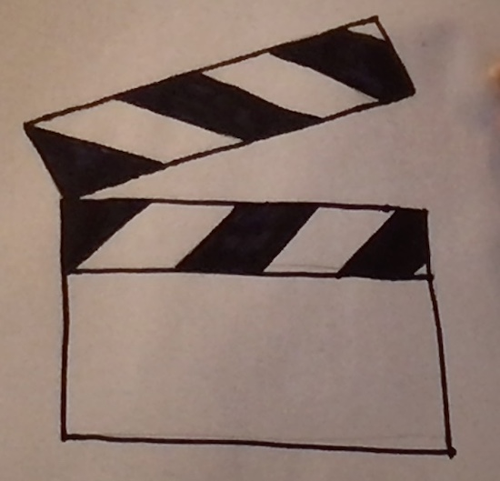

### Code Reviews
#### The Art and the Science

#### Maria Mckinley
#### Staff Software Engineer and SRE at Disney

# Outline
* Mental Models
* The trials of code reviews
* But, why?
* About Failure
* Making Code Reviews better

# Outline
* Mental Models
* The trials of code reviews
* But, why?
* About Failure
* Making Code Reviews better

## Mental Model of a Tree by a Scientist

## Mental Model of a Tree by a Child
 

## According to Gitlab:
## A code review is a peer review of code that helps developers ensure or improve the
## code quality before they merge and ship it.

## A better mental model:
## A code review is a way for a team to share knowledge, learn together and
## assess the quality of the code they are shipping before they ship it.

## Emphasize team growth and learning over code quality.
## Code quality follows from team quality

## Lots of research backs up the importance of teamwork on software development
### Leave it as an exercise for the audience, good place to start:
### https://www.atlassian.com/blog/teamwork/the-importance-of-teamwork

## I want to convince you that code reviews can be the pathway to a better team

# Outline
* Mental Models
* The trials of code reviews
* But, why?
* About Failure
* Making Code Reviews better

## What makes code reviews hard?

<!-- .slide: data-background-image="assets/headline.jpg"-->

---

## Developer failed!
### fear of failure
### fear of bad news

<!-- .slide: data-background-image="assets/headline.jpg"-->

---

## Developer gets in an argument!
### fear of conflict
### actual conflict, squabbles

<!-- .slide: data-background-image="assets/headline.jpg"-->

---

## Developer runs out of time!
### fear of losing
### fear of deadlines

# Outline
* Mental Models
* The trials of code reviews
* But, why?
* About Failure
* Making Code Reviews better

Frazz by Jef Mallett

### fixed mindset vs growth mindset
#### https://hiddenbrain.org/podcast/innovation-2-0-multiplying-the-growth-mindset/
### expectation we are done learning when we leave school

* Images of who is a software dev

https://hiddenbrain.org/podcast/you-2-0-befriending-your-inner-voice/

* not taught how to productively disagree
https://news.hiddenbrain.org/i/43578267/brain-waves

* taught to think of team members as our competition

# Outline
* Mental Models
* The trials of code reviews
* But, why?
* About Failure
* Making Code Reviews better

## Better Ways to Think of Failure

### Learn more from failure than success 

## Easier to learn from each other's mistakes
## Beneficial that you see other people make mistakes

## Mental Model: Failure is something for us to overcome
## Better Mental Model: Failure is a teaching tool

* Troubleshooting
* Systematically figuring out what does not work

## Your new mantra:
## You did not fail. The code failed, and you learned.

## Fundamentally, we take criticism too personally
## Ways to separate our work from our selves
### we are not the code we write
### we are working on something bigger than ourselves

# what have we learned about failure?
### We learn more from failure than success
### We learn more from other's failures
### Helps everyone to see that everyone makes mistakes

* Learn to think of your code separate from you
* Focus on your team, your project
* Learn to disagree constructively
* Difficult discussions is where growth and learning happen

# Outline
* Mental Models
* The trials of code reviews
* But, why?
* About Failure
* Making Code Reviews better

## Big picture when doing code reviews
* We are all humans that are taught to fear failure, be kind
* terse communication can feel like an attack
* switch from async to sync
* pair coding for the win

## Review the code reviews, retrospectives
* long back and forths in writing: talk instead!
* bike shedding
* rubber stamping

### Reviewee:
* follow checklist (self review)
* think about what you want to learn
* stuck? draft code review
* expect to learn something

### Reviewee (continued):
* respond, don't react (create distance to digest and get past the initial punch to the gut)
* play around with suggestions, request to hop on a call together
* patience with yourself

### Reviewee (continued):
* practice saysing, "that is interesting, let me think about that" to reviews

### Reviewer:
* write comments only after you have looked at all of the code: limits issues, clears questions
* ask for feedback, is this review helpful to you? imagine yourself reading your comments

### Reviewer (continued):
* find ways to complement the code
* be humble, you could be mistaken
* site evidence, verify beliefs, provide links
* good enough is good enough

### Team policies:
* Use processes and cicd to limit nitpicking
* limit code in a review
* value time spent doing code reviews, emphasize learning
* learn conflict resolution skills together

### Team policies (continued):
* do some code reviews "in person"
* Think like a team: Navy Seals succeed because they trust each other and they know "shit happens", but we can survive and thrive through it (they have a learning mind set!)
* Talk about expectations

### Team policies (continued):
* Forcing process is not the way to win hearts and minds
* Team Code of Conduct
* Things getting heated? Take a break!
* Foster growth mindset

### Being a team player
* Hey, someone reviewed my code today and I learned about this cool thing that they helped me implement, and now our code is better, and I learned something!
* Hey, I found this article about x, which I thought might be helpful for our implementation of y. What do you all think?

* Be curious
* Be a team player

# Thank you

### https://codedragon.github.io/code_reviews
### maria@mariakathryn.net
