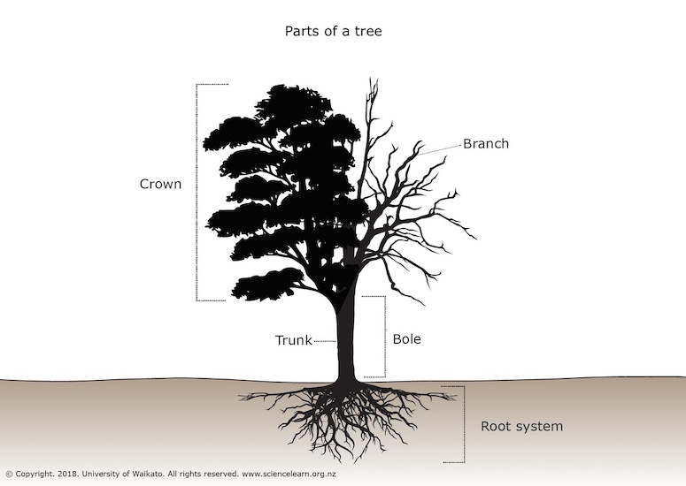

# Code Reviews
### The Art and the Science

## Maria Mckinley
## Staff Software Engineer and SRE at Disney

# Outline
* Mental Models
* The trials of code reviews
* But, why?
* About Failure
* Making Code Reviews better

# Outline
* Mental Models
* The trials of code reviews
* But, why?
* About Failure
* Making Code Reviews better

## Mental Model of a Tree by a Scientist

## Mental Model of a Tree by a Child
 

## According to Gitlab:
## A code review is a peer review of code that helps developers ensure or improve the
## code quality before they merge and ship it.

## A better mental model:
## A code review is a way for a team to share knowledge, learn together and
## assess the quality of the code they are shipping before they ship it.

## Emphasize team growth and learning over code quality.
## Code quality follows from team quality

## Lots of research backs up the importance of teamwork on software development
### Leave it as an exercise for the audience, good place to start:
### https://www.atlassian.com/blog/teamwork/the-importance-of-teamwork

## I want to convince you that code reviews can be the pathway to a better team

# Outline
* Mental Models
* The trials of code reviews
* But, why?
* About Failure
* Making Code Reviews better

## What makes code reviews hard?

## Wait, am I paid to think?

<!-- .slide: data-background-image="assets/newspaper.jpg"
     	     background-size="150% auto"
	     background-repeat="no-repeat"-->
# Developer failed!
## fear of failure
## fear of bad news

<!-- .slide: data-background-image="assets/newspaper.jpg"
     	     background-size="contain"
	     background-repeat="no-repeat"-->
# Developer gets in an argument!
# fear of conflict
# actual conflict, squables

<!-- .slide: data-background-image="assets/newspaper.jpg"
     	     background-size="contain"
	     background-repeat="no-repeat"-->
# Developer runs out of time!
## fear of losing
## fear of deadlines

## Why? Blindspots
* fixed mindset vs growth mindset 
* expectation we are done learning when we leave school
* not taught how to productively disagree
* image of code guru producing entire operating systems in basement

## Let's talk about the computer file system for a moment

## Git puts everything it needs to keep track of changes in a hidden directory called
## .git in the root directory of each repository

## ~/.gitconfig

## Installation: I like GitLab's instructions, but others are available
https://docs.gitlab.com/ee/topics/git/how_to_install_git/index.html
## Full, well laid out tutorial
https://docs.gitlab.com/ee/tutorials/make_your_first_git_commit.html

## Tools I chose for this Demo
* Command line
* Editor: emacs
* Git Central Repo: GitLab

# Let's create a repo
* command line: `git init`  
* https://gitlab.disney.com/projects/new
* https://docs.github.com/en/get-started/quickstart/create-a-repo

## How to set up ssh keys for authenticating - Highly recommended
### GitLab
https://docs.gitlab.com/ee/user/ssh.html
### Github
https://docs.github.com/en/authentication/connecting-to-github-with-ssh

## What's an origin?
* shorthand name for the address of the remote repo a project was cloned from
* default for further communication
* name is just a convention

## How do I see what is the origin?
`git remote -v`

## Workflow
* re-orient yourself to work
* see if others have made changes
* do your work

### Workflow continued
* proofread, decide on content for current change
* select what will be in the change
* add a descriptive note to your change
* put your changes in the common repo so everyone sees your changes

## Workflow
| Command | Description |
| ------- | --------- |
| `git status`  | re-orient yourself to work |
| `git pull` or  `git pull origin main` | see if others have made changes needs network |
|         | do work |

### Workflow continued
| Command | Description |
| ------- | --------- |
| `git diff` and/or  `git status`  | tools to proofread, decide on content |
| `git add`  | select what's included |
| `git commit -m`  | add a descriptive note |
| `git push`  | add changes to the common repo needs network |

# Demo

## Anatomy of a status response
| Output | Description |
| ------ | --------- |
| `On branch main` | branch currently on |
| `Your branch is up to date with 'origin/main'.` | commits all pushed to branch 'address/branch'|
| `Your branch is ahead of 'origin/main' by 1 commit.` | commits not pushed to branch 'address/branch' |  
#### * up-to-date with the upstream status that was retrieved last time we "talked" to the origin

### Anatomy of a status response continued
| Output | Description |
| ------ | --------- |
| `Changes not staged for commit:` | files with changes that have not been tagged for commit |
| `Changes to be committed:` | files with changes that have been tagged for commit |
| `Untracked files:` | files not ever recorded in git |

## Workflow Condensed
| Before Work | After Work |
| ------- | --------- |
| `git status`  | `git diff` and/or  `git status`  |
| `git pull` | `git add`  |
| do work | `git commit -m`  |
|         | `git push`  |

## Git Branching

### https://www.atlassian.com/git/tutorials/using-branches

## Other Useful Git Commands

| Command | Description |
| ------- | ----------- |
| `git checkout filename` | reverts filename to last commit |
| `git branch` | shows all local branchs, highlights current |
| `git switch branchname` | switch to a different branch named branchname |
| `git switch -c branchname` | switch to a new branch named branchname |

## More Useful Git Commands

| Command | Description |
| ------- | ----------- |
| `git clone repo_address` | create a directory containing a new repo from repo_address |
| `git merge branchname` | brings changes from branchname into current branch |

# Thank you
## A git pull a day keeps the conflicts away

### https://codedragon.github.io/beginning_git
### maria@mariakathryn.net
